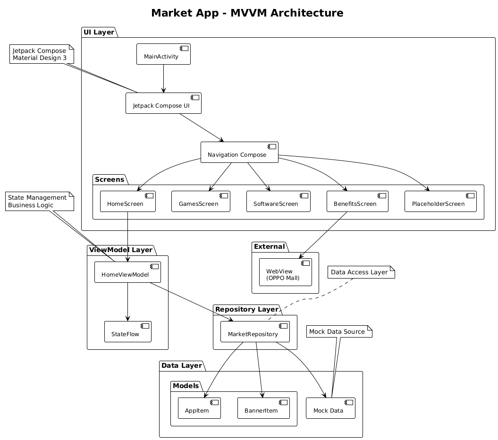
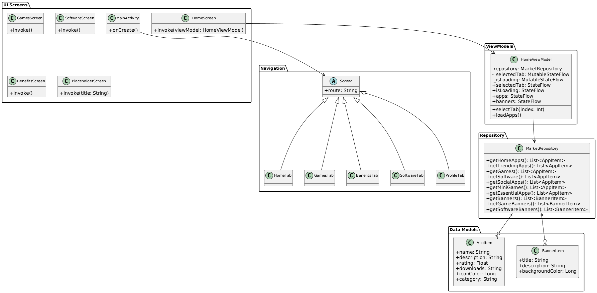

# 📱 Android 应用商店

<div align="center">

## 📲 立即下载


**扫码下载 APK 文件** | **版本: v1.0.0** | **大小: ~19MB**

[📥 直接下载 APK](https://github.com/JQ2020/market-app/raw/main/apk/app-debug.apk) | [🔗 GitHub 仓库](https://github.com/JQ2020/market-app)

---

</div>

一个基于 Jetpack Compose 开发的现代化 Android 应用商店，提供完整的应用浏览、搜索和管理功能。

## ✨ 功能特色

### 🏠 首页
- 🔍 智能搜索栏（支持语音输入）
- 🎯 多Tab切换（精选、应用时刻、小游戏、热门、必备）
- 🎠 自动轮播横幅（2.5秒间隔，平滑左滑效果）
- 📱 动态应用推荐列表
- ⭐ 应用评分和下载量显示

### 🎮 游戏页面
- 🎪 游戏主题轮播卡片
- 🏆 电竞大赛、新游首发、周末特惠等内容
- 🎯 游戏专属搜索功能
- 📊 游戏评分星级显示

### 🌐 福利合集
- 🌊 沉浸式 WebView 体验
- 🔗 集成 OPPO 商城页面
- ⚡ 智能加载状态和错误处理
- 📱 完美适配移动端浏览

### 💻 软件页面
- 🛠️ 软件主题轮播卡片
- 💼 办公神器、安全防护、创意设计、学习工具
- 🔍 软件专属搜索功能
- 📈 软件使用统计

### 👤 我的页面
- 🎨 用户信息卡片（VIP、认证标签）
- 📊 应用管理功能（更新、备份、应用锁）
- 💾 存储空间管理
- 🏥 系统健康状态评分
- 📈 系统使用统计
- 🛠️ 系统工具箱

## 🏗️ 技术架构

### 核心技术栈
- **UI框架**: Jetpack Compose
- **架构模式**: MVVM
- **导航**: Navigation Compose
- **状态管理**: StateFlow + ViewModel
- **网络**: WebView + Accompanist
- **设计**: Material Design 3

### 架构设计图

#### 🏛️ MVVM 架构图


本应用采用标准的 MVVM 架构模式，清晰分离了各个层次的职责：
- **UI Layer**: Jetpack Compose 界面层，包含各个 Screen 组件
- **ViewModel Layer**: 状态管理和业务逻辑处理
- **Repository Layer**: 数据访问抽象层
- **Data Layer**: 数据模型和数据源

#### 📊 类图结构


展示了应用的核心类结构和它们之间的关系：
- **Data Models**: AppItem、BannerItem 等数据模型
- **Repository**: MarketRepository 提供数据访问接口
- **ViewModels**: HomeViewModel 管理 UI 状态
- **UI Screens**: 各个页面组件
- **Navigation**: 导航路由管理

### 项目结构
```
app/src/main/java/com/example/market/
├── data/
│   ├── model/          # 数据模型
│   └── repository/     # 数据仓库
├── navigation/         # 导航配置
├── ui/
│   ├── screen/        # 页面组件
│   ├── viewmodel/     # 视图模型
│   └── theme/         # 主题配置
└── MainActivity.kt    # 主活动
```

## 🎨 设计亮点

### 轮播卡片
- 🎠 **自动轮播**: 2.5秒间隔自动切换
- 👆 **手势支持**: 支持左右滑动切换
- 🔘 **指示器**: 卡片内部底部显示当前位置
- 🎨 **主题化**: 不同页面展示不同主题内容

### 视觉效果
- 🌈 **渐变背景**: 丰富的色彩搭配
- 🎯 **圆角设计**: 现代化的卡片样式
- 💫 **阴影效果**: 层次分明的视觉层级
- 🎪 **动画过渡**: 流畅的页面切换动画

### 响应式布局
- 📱 **多屏适配**: 支持不同屏幕尺寸
- 🔄 **横竖屏**: 完美适配横竖屏切换
- ⚡ **性能优化**: LazyColumn 懒加载优化

## 🚀 快速开始

### 环境要求
- Android Studio Hedgehog | 2023.1.1+
- Android SDK 24+
- Kotlin 1.9.0+
- Gradle 8.0+

### 安装步骤
1. **克隆项目**
   ```bash
   git clone https://github.com/your-username/android-market.git
   cd android-market
   ```

2. **打开项目**
   - 使用 Android Studio 打开项目
   - 等待 Gradle 同步完成

3. **运行应用**
   - 连接 Android 设备或启动模拟器
   - 点击 Run 按钮或使用快捷键 `Ctrl+R`

## 📦 依赖库

```kotlin
// Compose BOM
implementation platform('androidx.compose:compose-bom:2023.10.01')

// Core Compose
implementation 'androidx.compose.ui:ui'
implementation 'androidx.compose.material3:material3'
implementation 'androidx.compose.ui:ui-tooling-preview'

// Navigation
implementation 'androidx.navigation:navigation-compose:2.7.6'

// ViewModel
implementation 'androidx.lifecycle:lifecycle-viewmodel-compose:2.7.0'

// Icons
implementation 'androidx.compose.material:material-icons-extended:1.5.8'

// WebView
implementation 'com.google.accompanist:accompanist-webview:0.32.0'
```

## 📱 应用截图

### 主要功能展示
- 🏠 **首页**: 轮播横幅 + 应用推荐
- 🎮 **游戏**: 游戏主题轮播 + 游戏列表
- 🌐 **福利**: 沉浸式 WebView 体验
- 💻 **软件**: 软件主题轮播 + 软件列表
- 👤 **我的**: 用户中心 + 系统管理

## 🔧 开发说明

### 自定义配置
1. **修改应用名称**: 在 `app/src/main/res/values/strings.xml` 中修改 `app_name`
2. **更换应用图标**: 替换 `app/src/main/res/mipmap-*/` 中的图标文件
3. **调整主题色彩**: 在 `ui/theme/Color.kt` 中自定义颜色方案

### 添加新功能
1. **新增页面**: 在 `ui/screen/` 目录下创建新的 Composable
2. **配置导航**: 在 `navigation/MarketNavigation.kt` 中添加路由
3. **数据管理**: 在 `data/` 目录下添加相应的模型和仓库

## 🤝 贡献指南

欢迎提交 Issue 和 Pull Request！

1. Fork 本仓库
2. 创建特性分支 (`git checkout -b feature/AmazingFeature`)
3. 提交更改 (`git commit -m 'Add some AmazingFeature'`)
4. 推送到分支 (`git push origin feature/AmazingFeature`)
5. 打开 Pull Request

## 📄 许可证

本项目采用 MIT 许可证 - 查看 [LICENSE](LICENSE) 文件了解详情

## 👨‍💻 作者

- **开发者**: Kratos

## 🙏 致谢

- [Jetpack Compose](https://developer.android.com/jetpack/compose) - 现代化 UI 工具包
- [Material Design 3](https://m3.material.io/) - 设计系统
- [Accompanist](https://github.com/google/accompanist) - Compose 扩展库

---

⭐ 如果这个项目对您有帮助，请给个 Star 支持一下！ 